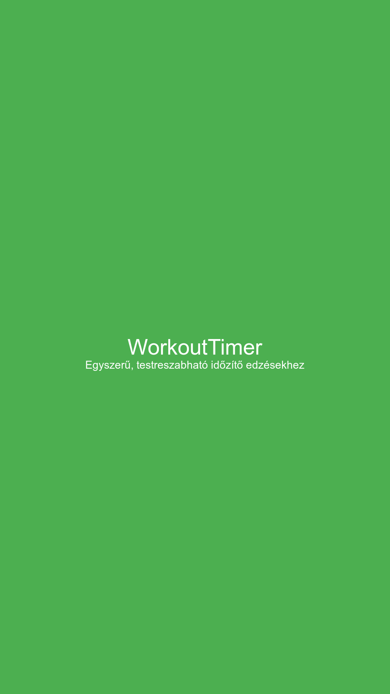

# Workout Timer

A modern Android interval workout timer app built with Kotlin, featuring a clean Material Design UI, bilingual support (English/Hungarian), and robust background timer management using Foreground Services.


## Features

- **Interval Timer**: Configurable workout/rest durations with customizable round counts
- **Background Timer**: Timer continues running when the app is backgrounded via Foreground Service
- **Audio & Haptic Feedback**: Sound signals and vibration on phase transitions
- **Countdown Beeps**: Audio countdown (3-2-1) before phase transitions
- **Visual Progress Bar**: Visual indicator showing workout/rest phase progress
- **Warm-up & Cool-down Phases**: Optional pre-workout warm-up and post-workout cool-down phases
- **Workout History**: Complete workout logging with Room Database persistence
- **Statistics Dashboard**: Track total workouts, total time, and average completion rate
- **Bilingual Support**: English and Hungarian languages with in-app switching
- **Material Design**: Dark theme with color-coded workout (green) and rest (red) phases
- **Responsive Layout**: Optimized layouts for both portrait and landscape orientations
- **Edge-to-Edge Display**: Modern UI with proper system bar insets handling
- **State Persistence**: Workout preferences saved using SharedPreferences
- **Comprehensive Test Suite**: Unit tests and UI tests for core functionality

## Screenshots

| Portrait | Landscape |
|----------|-----------|
|  |  |

## Architecture

The app follows a modern Android architecture with separation of concerns:

```
┌─────────────────────────────────────────────────────────────┐
│                        UI Layer                              │
│  ┌──────────────────┐         ┌──────────────────────┐      │
│  │   MainActivity    │         │  SettingsActivity     │      │
│  │  (ViewBinding)    │         │  (SharedPreferences)  │      │
│  └────────┬─────────┘         └──────────────────────┘      │
│           │                                                   │
│           ▼                                                   │
│  ┌──────────────────────────────────────────────────────┐    │
│  │              WorkoutTimerViewModel                    │    │
│  │         (StateFlow + SharedFlow)                      │    │
│  └────────┬─────────────────────────────────────────────┘    │
│           │                                                   │
│           ▼                                                   │
│  ┌──────────────────────────────────────────────────────┐    │
│  │             TimerForegroundService                    │    │
│  │         (Coroutine-based Timer Logic)                 │    │
│  └────────┬─────────────────────────────────────────────┘    │
│           │                                                   │
├───────────┼───────────────────────────────────────────────────┤
│           ▼                                                   │
│                     Data Layer                                │
│  ┌──────────────────┐         ┌──────────────────────┐      │
│  │ WorkoutPreferences│        │    WorkoutState       │      │
│  │  (SharedPreferences)       │    (Data Class)       │      │
│  └──────────────────┘         └──────────────────────┘      │
└─────────────────────────────────────────────────────────────┘
```

### Component Overview

| Component | Description |
|-----------|-------------|
| [`MainActivity`](app/src/main/java/com/menti/workoutTimer/MainActivity.kt) | Main UI screen displaying the timer, phase info, and controls. Uses ViewBinding and observes ViewModel state. |
| [`SettingsActivity`](app/src/main/java/com/menti/workoutTimer/SettingsActivity.kt) | Settings screen for configuring workout duration, rest duration, rounds, sound, vibration, language, and optional warm-up/cool-down phases. |
| [`WorkoutHistoryActivity`](app/src/main/java/com/menti/workoutTimer/WorkoutHistoryActivity.kt) | Activity displaying workout history with statistics and individual workout entries. |
| [`WorkoutTimerViewModel`](app/src/main/java/com/menti/workoutTimer/WorkoutTimerViewModel.kt) | Android ViewModel that manages UI state via `StateFlow<WorkoutState>` and one-time events via `SharedFlow<TimerEvent>`. Binds to the foreground service. |
| [`TimerForegroundService`](app/src/main/java/com/menti/workoutTimer/TimerForegroundService.kt) | Foreground service that runs the actual timer logic using coroutines. Displays a persistent notification with pause/resume/reset actions. Ensures the timer continues when the app is backgrounded. |
| [`WorkoutHistoryRepository`](app/src/main/java/com/menti/workoutTimer/WorkoutHistoryRepository.kt) | Repository for managing workout history data and computing statistics. |
| [`WorkoutState`](app/src/main/java/com/menti/workoutTimer/model/WorkoutState.kt) | Immutable data class representing the complete timer state. Includes `PhaseType` enum (WARMUP, WORKOUT, REST, COOLDOWN) and computed properties for progress percentage and formatted time. |
| [`WorkoutHistoryEntry`](app/src/main/java/com/menti/workoutTimer/model/WorkoutHistoryEntry.kt) | Room Entity representing a completed workout session with date, durations, rounds, and completion status. |
| [`WorkoutHistoryDao`](app/src/main/java/com/menti/workoutTimer/data/WorkoutHistoryDao.kt) | Room DAO interface for database operations (insert, query, delete, statistics). |
| [`WorkoutHistoryDatabase`](app/src/main/java/com/menti/workoutTimer/data/WorkoutHistoryDatabase.kt) | Room Database singleton for storing workout history. |
| [`WorkoutHistoryAdapter`](app/src/main/java/com/menti/workoutTimer/adapter/WorkoutHistoryAdapter.kt) | RecyclerView adapter for displaying workout history entries. |
| [`TimerEvent`](app/src/main/java/com/menti/workoutTimer/model/WorkoutState.kt#L58) | Sealed class for one-time events (phase changed, workout completed, play sound, vibrate, countdown beep). |
| [`WorkoutPreferences`](app/src/main/java/com/menti/workoutTimer/WorkoutPreferences.kt) | Wrapper around SharedPreferences for persisting user settings. |
| [`LocaleHelper`](app/src/main/java/com/menti/workoutTimer/LocaleHelper.kt) | Utility for applying custom locale at runtime. |

## Tech Stack

- **Language**: Kotlin 1.9.22
- **Min SDK**: 24 (Android 7.0)
- **Target SDK**: 35 (Android 15)
- **UI**: Material Design 3, ViewBinding, ConstraintLayout
- **Architecture**: MVVM with Foreground Service
- **Async**: Kotlin Coroutines + Flow (StateFlow, SharedFlow)
- **Lifecycle**: AndroidX Lifecycle (ViewModel, Runtime)
- **Storage**: SharedPreferences

## Project Structure

```
app/
├── src/main/
│   ├── java/com/menti/workoutTimer/
│   │   ├── model/
│   │   │   ├── WorkoutState.kt          # Data classes for state, events, and PhaseType enum
│   │   │   └── WorkoutHistoryEntry.kt   # Room entity for workout history
│   │   ├── data/
│   │   │   ├── WorkoutHistoryDao.kt     # Room DAO for database operations
│   │   │   └── WorkoutHistoryDatabase.kt # Room Database singleton
│   │   ├── adapter/
│   │   │   └── WorkoutHistoryAdapter.kt # RecyclerView adapter for history
│   │   ├── MainActivity.kt              # Main UI activity
│   │   ├── SettingsActivity.kt          # Settings activity
│   │   ├── WorkoutHistoryActivity.kt    # Workout history and statistics activity
│   │   ├── WorkoutTimerViewModel.kt     # ViewModel for timer state
│   │   ├── TimerForegroundService.kt    # Foreground service for timer
│   │   ├── WorkoutPreferences.kt        # SharedPreferences wrapper
│   │   ├── WorkoutHistoryRepository.kt  # Repository for workout history
│   │   └── LocaleHelper.kt              # Locale management
│   ├── res/
│   │   ├── layout/                      # Portrait layouts
│   │   ├── layout-land/                 # Landscape layouts
│   │   ├── values/                      # Default resources (colors, strings, themes)
│   │   ├── values-hu/                   # Hungarian translations
│   │   ├── drawable/                    # Custom drawables
│   │   ├── mipmap-*/                    # App launcher icons
│   │   └── xml/                         # Backup and data extraction rules
│   └── AndroidManifest.xml              # App manifest with service declaration
├── src/test/                            # Unit tests
│   └── java/com/menti/workoutTimer/
│       ├── MainCoroutineRule.kt         # Coroutines test rule
│       ├── WorkoutStateTest.kt          # WorkoutState unit tests
│       ├── WorkoutHistoryEntryTest.kt   # WorkoutHistoryEntry unit tests
│       ├── WorkoutPreferencesTest.kt    # WorkoutPreferences unit tests
│       └── data/
│           └── WorkoutHistoryDaoTest.kt # DAO unit tests
├── src/androidTest/                     # Instrumented UI tests
│   └── java/com/menti/workoutTimer/
│       ├── MainActivityTest.kt          # MainActivity UI tests
│       └── SettingsActivityTest.kt      # SettingsActivity UI tests
├── build.gradle                         # Module-level build config
└── proguard-rules.pro                   # ProGuard rules
```

## Building the Project

### Prerequisites

- Android Studio Hedgehog or later
- JDK 8 or later
- Android SDK with API 35

### Build Commands

```bash
# Debug build
./gradlew assembleDebug

# Release build
./gradlew assembleRelease

# Run tests
./gradlew test

# Run lint checks
./gradlew lint
```

### Signing Configuration

> **Warning**: The current signing configuration uses hardcoded credentials. For production builds, move credentials to `keystore.properties` (gitignored).

```groovy
// Recommended: Use environment variables or properties file
def keystorePropertiesFile = rootProject.file("keystore.properties")
def keystoreProperties = new Properties()
if (keystorePropertiesFile.exists()) {
    keystoreProperties.load(new FileInputStream(keystorePropertiesFile))
}
```

## Usage

### Starting a Workout

1. Open the app
2. Tap **Start** to begin the workout
3. The timer will count down through workout and rest phases
4. Use **Pause** to pause and **Resume** to continue
5. Use **Reset** to return to the initial state

### Configuring Settings

1. Tap **Settings** on the main screen
2. Adjust:
   - **Workout duration** (seconds)
   - **Rest duration** (seconds)
   - **Number of rounds**
   - **Sound** and **Vibration** toggles
   - **Language** (English / Hungarian)
3. Tap **Save** to apply changes

### Background Timer

The timer runs as a Foreground Service, meaning:
- A persistent notification shows the current phase and remaining time
- You can pause/resume/reset from the notification
- The timer continues even if you switch apps or lock the screen

## Permissions

| Permission | Purpose |
|------------|---------|
| `VIBRATE` | Haptic feedback on phase transitions |
| `FOREGROUND_SERVICE` | Run timer in background |
| `FOREGROUND_SERVICE_SPECIAL_USE` | Android 14+ foreground service type |

## Localization

| Language | Resource File |
|----------|---------------|
| English (default) | [`values/strings.xml`](app/src/main/res/values/strings.xml) |
| Hungarian | [`values-hu/strings.xml`](app/src/main/res/values-hu/strings.xml) |

## Future Improvements

- [ ] Preset workout templates (HIIT, Tabata, etc.)
- [ ] Voice announcements via Text-to-Speech
- [ ] Custom sound selection
- [ ] Wear OS companion app
- [ ] Dependency injection with Hilt
- [ ] Migrate SettingsActivity to ViewBinding

## License

This project is licensed under the MIT License - see the [LICENSE](LICENSE) file for details.

## Author

Menti Workout Timer Team
